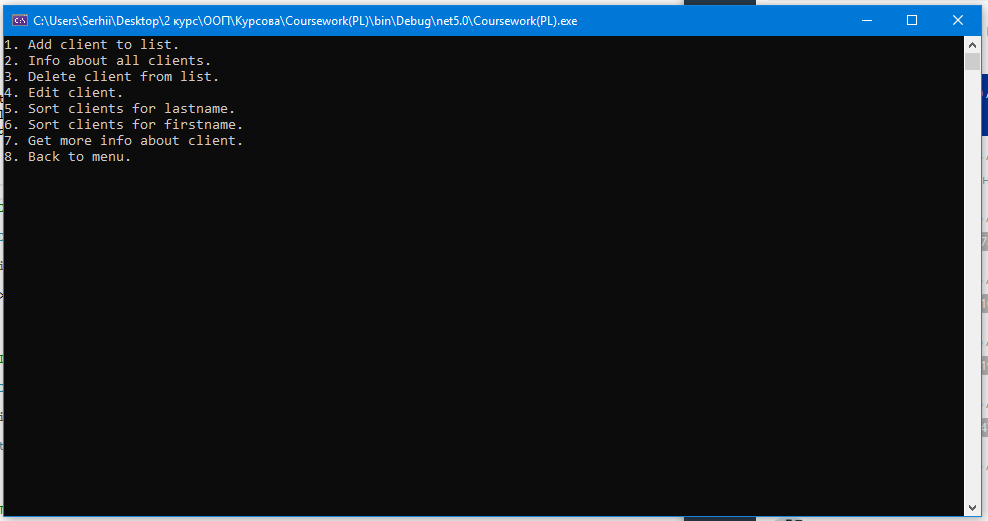
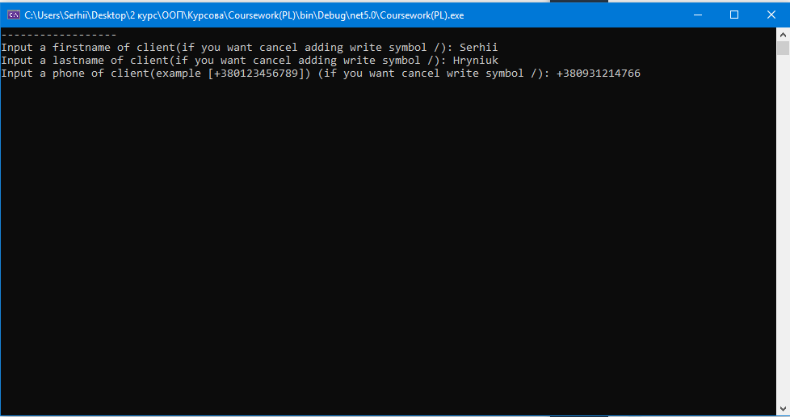

# coursework-hotel-var3
Обєктно-орієнтоване програмування, Курсова робота, 3 варіант, Гринюк Сергій Олександрович, ПІ-221

Нижче показаний функціонал програми:

# Головне меню у програмі

# Меню повязане з готелями

Добавлення готелю до списку

Інформіця про всі готелі

Видалення готелю із списка

Отримання детальної інформації про готель

# Меню повязане з клієнтами

Добавлення клієнта до списку

Інформація про всіх клієнтів

Видалення клієнта

Редагування клієнта

Отримання більше інформації про клієнта

# Меню повязане з замовленнями

Добавлення замовлення до списку

Інформація про всі замовлення

Видалення замовлення

Редагування частково замовлення

Отримання більше інформації про замовлення

